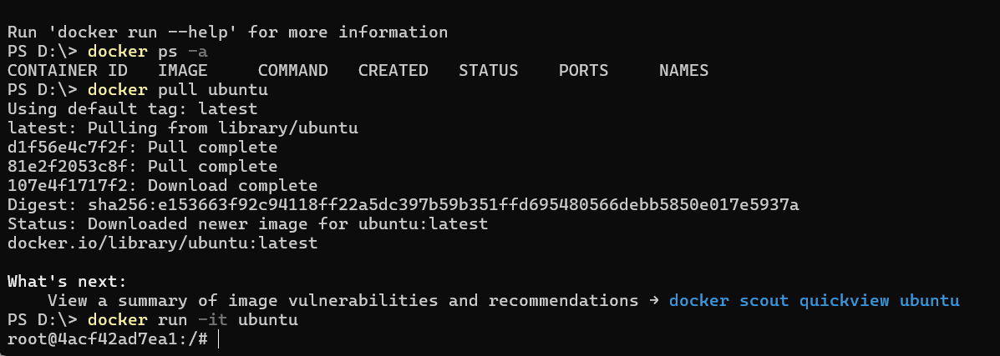
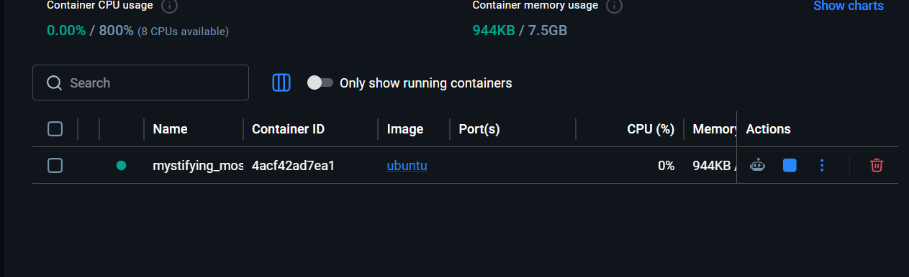
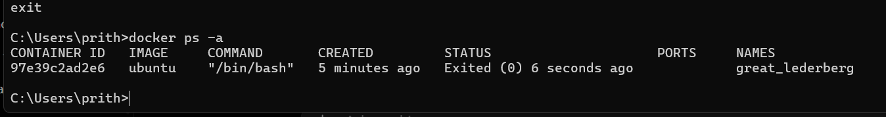
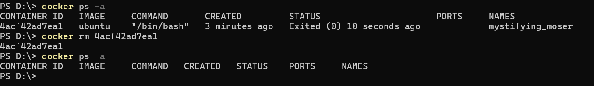
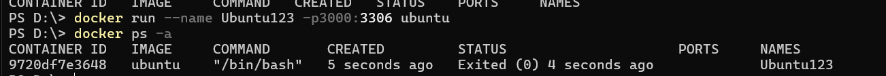
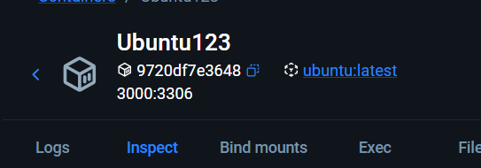
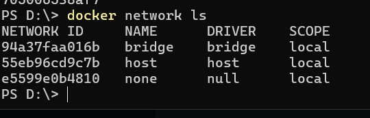
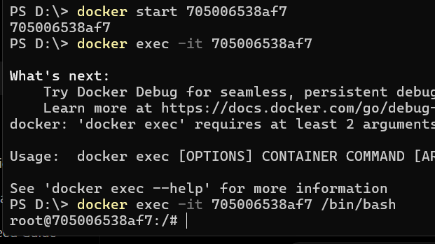

# Docker Hands on Labs

## Firstly I installed Docker itself by visiting Docker's Website.

[Docker Desktop Windows Installation Guide](https://docs.docker.com/desktop/setup/install/windows-install/)

After Setting up Docker Desktop. 
Access CLI and performed Commands like.

### 1. Pull Image and Run Container

This commands are used to get docker image from Docker hub. 

```bash
docker pull ubuntu
```

This Command is used to Create and Run a Docker Container using the downloaded Image.

```bash
docker run -it ubuntu
```




### 2. Listing Container

This commands is used to list all containers made in Docker. 

```bash
docker ps -a
```




### 3. Deleting Container

This commands is used to delete a container. 

```bash
docker rm <container name>
```




### 4. Port Binding

This is the same command as run but with an port binding option. 

```bash
docker run -p3000:3360 ubuntu
```





### 5. Docker Networks

This command is used to list all the Docker Networks present at the moment. 

```bash
docker network ls
```



### 6. Accessing Bash Terminal of Ubuntu image.

This command lets us access the container's CLI.

```bash
docker exec -it <container-name> /bin/bash
```

to check if the container contains bash or not we can check it with **docker ps -a**


