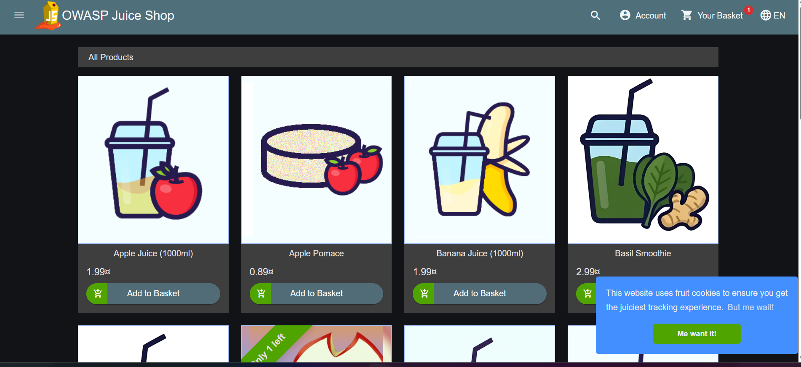

# OWASP Juice Shop - Authentication Flow

## Objective
Understand how login requests are handled between the browser and server.

## Environment Setup

Run Juice Shop:

docker run -d -p 3000:3000 --name juice-shop bkimminich/juice-shop

---

## Observation 1 - Invalid Login

### Endpoint
POST /rest/user/login

### Status Code
401 Unauthorized

### Request Payload

{
  "email": "oops@gmail.com",
  "password": "admin"
}

### Screenshot

[Screenshots/2.png]

### Understanding

The browser sent the user's email and password to the server using a POST request.

The server validated the credentials and determined they were invalid. The server then responded with HTTP status code 401 Unauthorized and denied authentication.

### Concepts Learned

- POST requests can send data to the server.
- Authentication credentials are sent inside the request payload.
- 401 Unauthorized indicates authentication failure.
- The server validates credentials before granting access.
