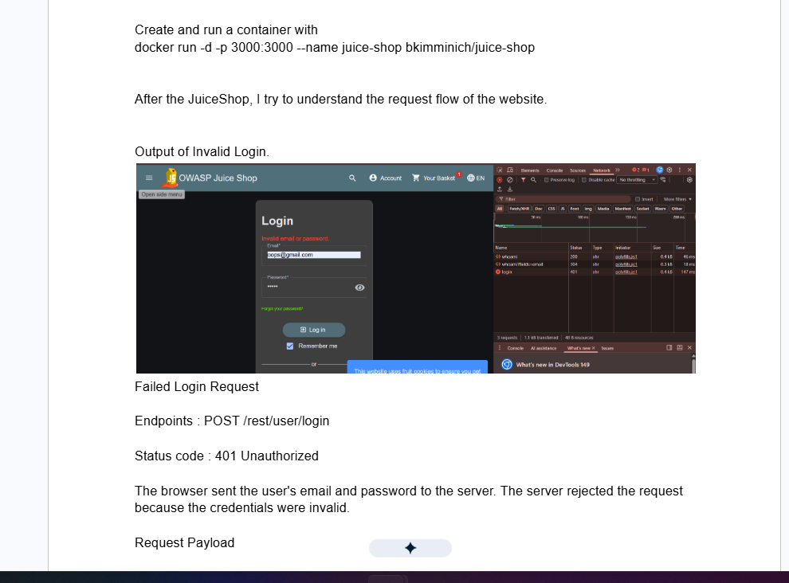
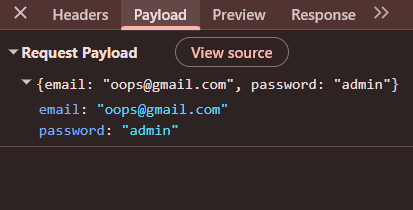
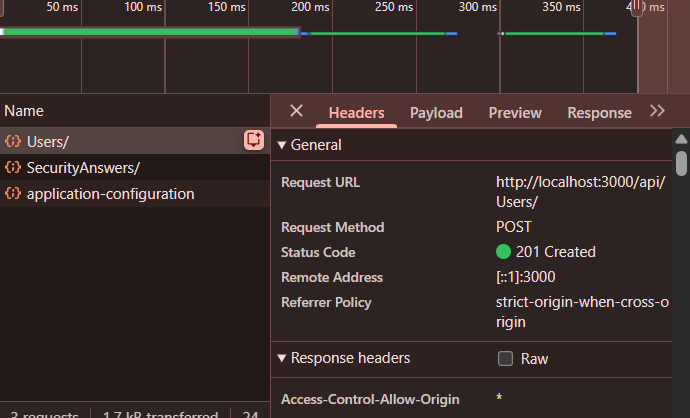
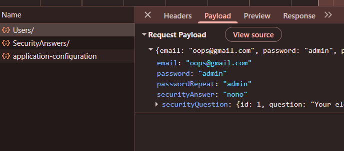

# OWASP Juice Shop - Authentication Flow

## Objective
Understand how login requests are handled between the browser and server.

## Environment Setup

Run Juice Shop:

docker run -d -p 3000:3000 --name juice-shop bkimminich/juice-shop

---

## Observation 1 - Invalid Login

### Endpoint
POST /rest/user/login

### Status Code
401 Unauthorized

### Request Payload

{
  "email": "oops@gmail.com",
  "password": "admin"
}

### Screenshot

### Understanding

The browser sent the user's email and password to the server using a POST request.

The server validated the credentials and determined they were invalid. The server then responded with HTTP status code 401 Unauthorized and denied authentication.

### Concepts Learned

- POST requests can send data to the server.
- Authentication credentials are sent inside the request payload.
- 401 Unauthorized indicates authentication failure.
- The server validates credentials before granting access.

---

## Observation 2 - User Registration

### Objective

Understand how a new user account is created in OWASP Juice Shop.

### Endpoint

POST /api/Users/

### Request Method

POST

### Status Code

201 Created

### Request Payload

{
  "email": "oops@gmail.com",
  "password": "admin",
  "passwordRepeat": "admin",
  "securityAnswer": "nono",
  "securityQuestion": {
    "id": 1
  }
}

### Screenshot

### Understanding

The browser sent the registration form data to the server using a POST request.

The payload contained:

- User email
- User password
- Password confirmation
- Security question ID
- Security answer

The server validated the information and created a new user account.

The server responded with HTTP Status Code 201 Created, indicating that the account was successfully created.

### Concepts Learned

- Registration is performed through an API endpoint.
- User information is sent inside the request payload.
- POST requests are used to create new resources.
- HTTP 201 Created indicates successful resource creation.
- Security questions and answers are collected during registration and stored separately by the application.
